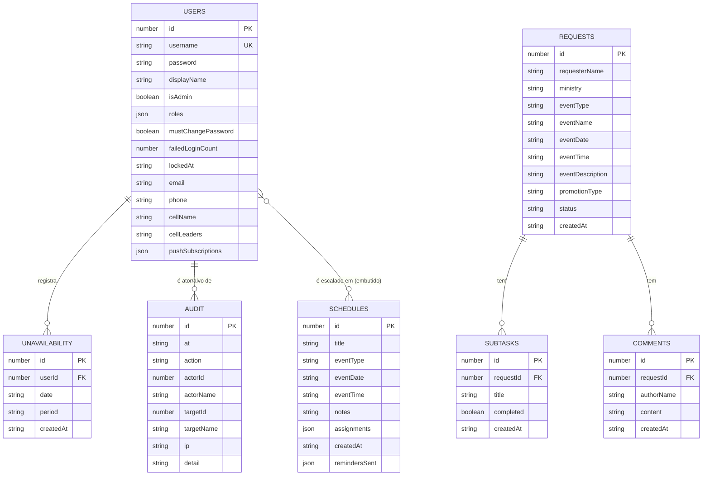

# Modelo de Dados

Fonte da verdade dos tipos: [`shared/schema.ts`](../../shared/schema.ts).
Persistência real: DynamoDB, via [`server/storage-dynamo.ts`](../../server/storage-dynamo.ts).

> **Leia antes de tudo:** o schema é declarado com `pgTable` do `drizzle-orm/pg-core`, mas
> **não existe PostgreSQL neste sistema**. O Drizzle é usado exclusivamente como gerador de
> tipos TypeScript e de schemas Zod (`createInsertSchema`). Ver
> [ADR-0002](../decisions/ADR-0002-drizzle-como-fonte-de-tipos.md).

## Diagrama de entidades



Relações são **por convenção da aplicação**, não por constraint: o DynamoDB não impõe
integridade referencial. Apagar um usuário **não** apaga suas indisponibilidades nem o
remove de escalas já criadas — ver [`backlog.md`](../backlog.md).

## Tabelas DynamoDB

Todas com `billing_mode = PAY_PER_REQUEST` e chave de partição `id` (Number).
Definidas em [`infra/dynamodb.tf`](../../infra/dynamodb.tf).

| Tabela | Nome do recurso | GSI | Variável de ambiente |
|---|---|---|---|
| Usuários | `bdn-comunicacao-users` | `username-index` (hash `username`, projeção ALL) | `TABLE_USERS` |
| Solicitações | `bdn-comunicacao-requests` | `ministry-date-index` (hash `ministry`, range `eventDate`) | `TABLE_REQUESTS` |
| Subtarefas | `bdn-comunicacao-subtasks` | `requestId-index` | `TABLE_SUBTASKS` |
| Comentários | `bdn-comunicacao-comments` | `requestId-index` | `TABLE_COMMENTS` |
| Escalas | `bdn-comunicacao-schedules` | — | `TABLE_SCHEDULES` |
| Indisponibilidade | `bdn-comunicacao-unavailability` | `userId-index` | `TABLE_UNAVAILABILITY` |
| Auditoria | `bdn-comunicacao-audit` | — (com *point-in-time recovery* ligado) | `TABLE_AUDIT` |

> **Ao adicionar uma tabela, atualize TRÊS pontos:**
> 1. [`infra/dynamodb.tf`](../../infra/dynamodb.tf) — o recurso;
> 2. bloco `environment` da Lambda em [`infra/lambda.tf`](../../infra/lambda.tf) — a variável;
> 3. a policy IAM `lambda_dynamodb` no mesmo arquivo — o ARN.
>
> Esquecer o passo 3 produz `AccessDeniedException` só em runtime, só em produção.

## Geração de IDs

O DynamoDB não tem auto-incremento. [`server/storage-dynamo.ts`](../../server/storage-dynamo.ts):

```ts
generateId()        // Date.now() * 1000 + random(0..999)
generateRequestId() // 1000 + (Date.now() % 1_000_000) * 1000 + random(0..999)
```

`generateRequestId` produz números menores, legíveis como protocolo (`#1234…`), mantendo
compatibilidade visual com o `MemStorage`, que começa em 1000. A colisão é improvável no
volume real e **não é protegida por escrita condicional** — risco aceito
([Artigo I](../constitution.md)).

## Entidades

### `users`

| Campo | Tipo | Regra |
|---|---|---|
| `id` | number | PK |
| `username` | string | Único (via GSI, não por constraint — a rota `POST /api/users` checa antes) |
| `password` | string | `scrypt:<salt>:<hash>`; texto puro herdado é aceito e migrado no login |
| `displayName` | string | Nome exibido em escalas e comentários |
| `isAdmin` | boolean | Padrão `false` |
| `roles` | `ScheduleRole[]` | Vazio = não é voluntário, não entra em escalas |
| `mustChangePassword` | boolean | `true` quando um admin definiu a senha |
| `failedLoginCount` | number | Zera no acerto |
| `lockedAt` | string \| null | ISO 8601; preenchido = conta bloqueada |
| `email`, `phone`, `cellName`, `cellLeaders` | string \| null | Perfil, preenchido pelo próprio membro |
| `pushSubscriptions` | `PushSubscription[]` | Aparelhos inscritos nos lembretes de escala. Vazio = a pessoa não recebe notificação. Máximo de 5 ([spec 008](../specs/008-lembretes-de-escala.md)) |

**Nunca serializado ao cliente:** `password` e `pushSubscriptions`. Toda rota responde
`toSafeUser(user)` (`shared/schema.ts`), e `SafeUser` exclui os dois em tipo. As assinaturas
saem da lista porque endereço de push + chaves permitem **enviar** notificação para o
aparelho da pessoa — é credencial, não cadastro. O admin recebe só `hasPushReminders`,
derivado.

**Visibilidade assimétrica em `GET /api/users`:** admin recebe o cadastro completo; usuário
comum recebe apenas `id`, `username`, `displayName`, `isAdmin`, `roles`. Telefone e e-mail
da equipe não são lista de contatos.

**Normalização na leitura** (`normalizeUser`): contas criadas antes de um campo existir
recebem o padrão seguro — `roles: []`, perfil `null`, `mustChangePassword: false`,
`failedLoginCount: 0`, `lockedAt: null`.

### `requests`

| Campo | Valores |
|---|---|
| `eventType` | `"culto"` \| `"outro"` |
| `promotionType` | `"interna"` \| `"externa"` |
| `status` | `"pendente"` \| `"em_andamento"` \| `"concluida"` \| `"cancelada"` |
| `eventDate` / `eventTime` | `YYYY-MM-DD` / `HH:mm` |
| `createdAt` | ISO 8601 |

Nenhum desses domínios é um enum Zod — a validação de `status` é uma lista literal em
[`server/routes.ts`](../../server/routes.ts), e `eventType`/`promotionType` só são validados
no formulário do cliente. Dívida registrada no [`backlog.md`](../backlog.md).

**Conflito:** `getRequestsByMinistryAndDate` consulta o GSI `ministry-date-index` filtrando
`status <> "cancelada"`. Uma solicitação cancelada libera a data.

### `subtasks` e `comments`

Filhos de `requests`, ligados por `requestId` (GSI `requestId-index`). Subtarefas ordenam por
`id`; comentários, por `createdAt` crescente. `authorName` do comentário vem **sempre** da
sessão do autor, nunca do corpo do request.

### `schedules`

| Campo | Regra |
|---|---|
| `title` | Texto livre; padrão `"Culto"` |
| `eventType` | `"culto"` \| `"especial"` |
| `eventDate` / `eventTime` | `YYYY-MM-DD` / `HH:mm` — o horário determina o **período** |
| `notes` | string \| null |
| `assignments` | `ScheduleAssignment[]` **embutido** |
| `remindersSent` | `string[]` — lembretes já disparados, no formato `` `${tipo}:${volunteerId}` `` |

```ts
interface ScheduleAssignment {
  role: ScheduleRole;      // fotografia | filmmaker | projecao | transmissao | treinamento
  volunteerId: number;
  volunteerName: string;   // desnormalizado, congelado no momento da escala
}
```

**Por que embutir e desnormalizar o nome:** ler a escala é uma única leitura, sem join. E o
nome congelado preserva o histórico — se a pessoa mudar o `displayName`, escalas antigas
continuam mostrando quem estava escalado à época.

**Consequência a conhecer:** mudar `displayName` **não** atualiza escalas futuras já
criadas. Se isso incomodar, a correção é reescrever as escalas futuras — não "consertar" a
desnormalização.

**Ordenação canônica:** `${eventDate} ${eventTime}` crescente, lexicográfica.

**Duplicata:** a chave lógica de um culto é `(eventDate, eventTime)` — a geração automática
pula datas/horários já ocupados. Isso **não** é imposto pelo banco; criação manual pode
duplicar.

**`remindersSent` não vem do formulário.** É escrito só pelo job de lembretes, com um
`UpdateItem` condicional (`claimReminder`) que grava a marca apenas se ela ainda não existir
— é o que garante que ninguém receba o mesmo aviso duas vezes quando a Lambda é
reexecutada. `insertScheduleSchema` omite o campo, e `updateSchedule` usa o item atual como
base justamente para o histórico sobreviver à edição da escala. Detalhes na
[spec 008](../specs/008-lembretes-de-escala.md).

### `unavailability`

| Campo | Regra |
|---|---|
| `userId` | Dono do registro |
| `date` | `YYYY-MM-DD` |
| `period` | `"manha"` \| `"tarde"` \| `"noite"` \| `"dia"` |

`"dia"` cobre os três períodos. A criação é **idempotente e absorvente**
(`createUnavailability` em ambas as implementações de storage):

1. Já existe `"dia"` naquela data → devolve o existente, não cria nada.
2. Já existe o mesmo período → devolve o existente.
3. O novo é `"dia"` → apaga os períodos já registrados naquela data e cria o `"dia"`.

Registros anteriores ao campo `period` são lidos como `"dia"` (`unavailabilityPeriod`).

**Mapeamento horário → período** (`periodOfTime`, em `shared/schema.ts`):

| Horário | Período |
|---|---|
| `00:00`–`11:59` | `manha` |
| `12:00`–`17:59` | `tarde` |
| `18:00`–`23:59` | `noite` |

### `audit`

Append-only. Ver [spec 007](../specs/007-trilha-de-auditoria.md) e
[`security.md`](security.md).

| Campo | Regra |
|---|---|
| `at` | ISO 8601 |
| `action` | Um de `AUDIT_ACTIONS` |
| `actorId` / `actorName` | Quem agiu; `null` em login que falhou antes de identificar a conta |
| `targetId` / `targetName` | Sobre quem; no login é a própria conta |
| `ip` | `req.ip` (real, graças a `trust proxy`) |
| `detail` | Texto livre curto (ex.: `"tentativa 3/8"`) |

Ações: `login.success`, `login.failure`, `login.blocked`, `account.locked`,
`account.unlocked`, `password.change`, `password.reset`, `user.create`, `user.delete`,
`admin.grant`, `admin.revoke`.

**Nunca gravar:** senha, hash, token, corpo de request.

## Constantes de domínio

Todas em [`shared/schema.ts`](../../shared/schema.ts) — **importe, não recopie**:

| Constante | Valor / conteúdo |
|---|---|
| `SCHEDULE_ROLES` | `["fotografia","filmmaker","projecao","transmissao","treinamento"]` — **a ordem importa**: o treinamento é o último, e a geração automática depende disso |
| `SCHEDULE_ROLE_LABELS` | Rótulos em português |
| `TRAINING_ROLE` | `"treinamento"` |
| `OPERATIONAL_ROLES` | `SCHEDULE_ROLES` menos o treinamento |
| `UNAVAILABILITY_PERIODS` | `["manha","tarde","noite","dia"]` |
| `EVENT_PERIODS` | `["manha","tarde","noite"]` — `"dia"` não é período de evento |
| `MAX_FAILED_LOGINS` | `8` |
| `PASSWORD_MIN_LENGTH` | `10` |
| `ROOT_ADMIN_USERNAME` | `"admin"` |
| `AUDIT_ACTIONS` / `AUDIT_ACTION_LABELS` | Ações auditadas e seus rótulos |
| `MINISTRIES` | 22 ministérios da igreja |
| `OVERLOAD_THRESHOLD` | `4` — **exceção: mora em [`client/src/lib/escalas.ts`](../../client/src/lib/escalas.ts)**, porque o aviso é só de UI |

## Funções de regra compartilhadas

| Função | Onde | Faz |
|---|---|---|
| `passwordIssue(senha, username?)` | `shared/schema.ts` | Retorna a mensagem do problema ou `null` |
| `isRootAdmin(user)` | `shared/schema.ts` | Compara `username` com `"admin"` (trim + lowercase) |
| `isLocked(user)` | `shared/schema.ts` | `Boolean(lockedAt)` |
| `isTrainingRole(role)` | `shared/schema.ts` | Se a função é treinamento |
| `periodOfTime(hhmm)` | `shared/schema.ts` | Horário → período |
| `unavailabilityPeriod(v)` | `shared/schema.ts` | Normaliza período legado para `"dia"` |
| `trainingConflicts(events)` | `shared/schema.ts` | Nomes em treinamento **e** em outra função no mesmo período |
| `trainingConflictMessage(nomes)` | `shared/schema.ts` | Mensagem única para cliente e API |
| `blocksPeriod(entry, event)` | `client/src/lib/escalas.ts` | Se a indisponibilidade cobre o período do evento |
| `rosterOfPeriod(...)` | `client/src/lib/escalas.ts` | Quem já está em treinamento / trabalhando num período |
| `monthlyLoadByVolunteer(...)` | `client/src/lib/escalas.ts` | Escalas por voluntário/mês (2 funções no mesmo evento contam 1) |

## Schemas Zod exportados

| Schema | Usado em |
|---|---|
| `insertRequestSchema` | `POST /api/requests` |
| `insertSubtaskSchema` | `POST /api/requests/:id/subtasks` |
| `insertCommentSchema` | `POST /api/requests/:id/comments` |
| `insertScheduleSchema` | `POST/PUT /api/schedules`, `POST /api/schedules/bulk` |
| `insertUnavailabilitySchema` | Tipo do storage (a rota valida com um schema inline mais estrito) |
| `adminCreateUserSchema` | `POST /api/users` — omite `id`, `mustChangePassword`, `failedLoginCount`, `lockedAt` |
| `updateProfileSchema` | `PATCH /api/users/me` |
| `changePasswordSchema` | `PATCH /api/users/me/password` |
| `adminResetPasswordSchema` | `POST /api/users/:id/reset-password` |

Todos os `insert*` omitem `id` e `createdAt` — quem os gera é o storage. Campos de estado
de segurança (`isAdmin`, `mustChangePassword`, `failedLoginCount`, `lockedAt`) são decididos
pelo servidor e **nunca** aceitos do corpo do request.
