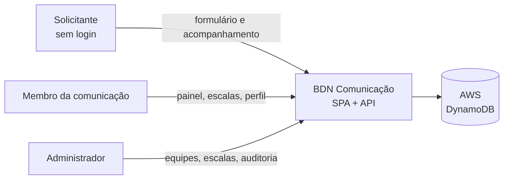
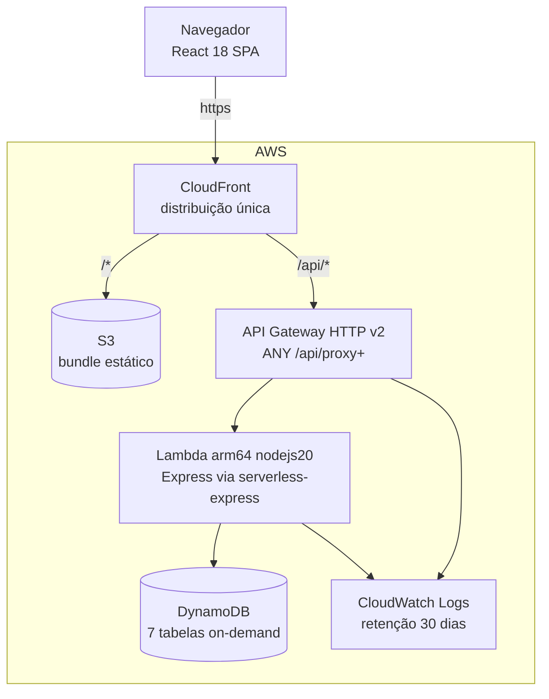

# Arquitetura — Visão Geral

## Resumo em uma frase

SPA React servida por CloudFront/S3, falando com um único app Express empacotado como
função Lambda atrás do API Gateway, persistindo em sete tabelas DynamoDB — com os tipos e
as regras de negócio compartilhados entre cliente e servidor por um pacote `shared/`.

## Contexto (nível 1)



Não há integração com sistema externo: sem e-mail, sem pagamento, sem SSO, sem webhook.
A superfície externa do sistema é o navegador.

## Containers (nível 2)



**Ponto-chave:** o front e a API saem do **mesmo domínio** do CloudFront. Isso é o que
permite `sameSite: "strict"` no cookie de sessão e dispensa CORS
(`cors_allowed_origins` é `[]` por padrão em [`infra/variables.tf`](../../infra/variables.tf)).
Quebrar o same-origin quebra a sessão.

## Componentes (nível 3)

```
client/src/
├── main.tsx              Bootstrap; força hash "#/" na primeira carga
├── App.tsx               Rotas (wouter + useHashLocation) e PasswordChangeGate
├── lib/
│   ├── auth.ts           Store de sessão do cliente (só dados de exibição)
│   ├── queryClient.ts    fetch com credentials:"include"; 401 derruba a sessão local
│   └── escalas.ts        Regras de escala do lado do cliente (rodízio, carga, roster)
├── pages/                Uma página por rota
└── components/
    ├── Navbar.tsx        Navegação + logout
    ├── escalas/          ScheduleCard, ScheduleFormDialog, AutoGenerateDialog,
    │                     TeamRolesManager, OverloadWarning
    └── ui/               shadcn/ui sobre Radix — não editar sem motivo

shared/
└── schema.ts             Entidades, schemas Zod, constantes e REGRAS DE NEGÓCIO
                          compartilhadas (senha, treinamento, períodos, raiz, bloqueio)

server/
├── index.ts              Entrypoint de desenvolvimento (Vite middleware) e de `npm start`
├── lambda.ts             Entrypoint de produção (handler da Lambda)
├── routes.ts             TODAS as rotas HTTP, rate limits e middlewares de auth
├── storage.ts            Interface IStorage + MemStorage (dev) + seleção da implementação
├── storage-dynamo.ts     DynamoStorage (produção)
├── tokens.ts             Emissão/verificação do JWT e cookie de sessão
├── password.ts           Hash scrypt e verificação
├── audit.ts              Gravação da trilha de auditoria (nunca derruba a operação)
├── static.ts             Serve dist/public em `npm start`
└── vite.ts               Servidor de desenvolvimento com HMR

infra/                    Terraform (S3, CloudFront, API Gateway, Lambda, DynamoDB, IAM)
script/build.ts           Build do cliente + dois bundles do servidor + ZIP da Lambda
```

## Stack

| Camada | Escolha | Observação |
|---|---|---|
| UI | React 18, TypeScript 5.6 | `strict: true` |
| Roteamento | **wouter** com `useHashLocation` | Rotas são `/#/escalas`; ver "Armadilhas" |
| Estado servidor | TanStack Query v5 | `staleTime: Infinity`, `retry: false`, sem refetch on focus |
| Formulários | react-hook-form + Zod (`@hookform/resolvers`) | |
| Estilo | Tailwind 3 + shadcn/ui sobre Radix | Tema **dark** fixo (`<html class="dark">`) |
| Build cliente | Vite 7 | `base: "./"`, saída em `dist/public` |
| API | Express 5 | `helmet` (CSP desligada), `cookie-parser`, `express-rate-limit` |
| Sessão | `jsonwebtoken` HS256 em cookie `HttpOnly` | TTL 12h |
| Hash de senha | `crypto.scryptSync` do Node | Sem dependência nativa → bundle leve |
| Persistência | DynamoDB via `@aws-sdk/lib-dynamodb` | `PAY_PER_REQUEST` |
| Tipos de dados | `drizzle-orm/pg-core` + `drizzle-zod` | **Só como fonte de tipos** — ver [ADR-0002](../decisions/ADR-0002-drizzle-como-fonte-de-tipos.md) |
| Infra | Terraform ≥ 1.5, provider AWS ~> 5.0 | |

## Fluxo de uma requisição autenticada

```
Navegador
  fetch("/api/schedules", { credentials: "include" })
      │  cookie bdn_session vai junto (mesmo domínio)
      ▼
CloudFront  (behavior /api/* — sem cache, encaminha cookies e headers)
      ▼
API Gateway (rota ANY /api/{proxy+}, throttle 20 rps / burst 50)
      ▼
Lambda → serverless-express → app Express
      │  1. remove o prefixo do stage da URL (ex.: "/production")
      │  2. apiLimiter (600 req / 15 min)
      │  3. requireUser / requireAdmin:
      │        lê o cookie → verifyToken (HS256 + issuer)
      │        → storage.getUser(sub)
      │        → matchesCurrentPassword (impressão digital da senha no claim `pv`)
      │        → isLocked? → 401
      ▼
Handler da rota → storage.* → DynamoDB
      ▼
JSON de volta (nunca com o campo `password`)
```

**O usuário é recarregado do banco a cada request.** É o que faz troca de senha, revogação
de admin, bloqueio e exclusão de conta valerem **imediatamente**, sem lista de revogação.

## Decisões estruturais e suas consequências

### 1. Um único app Express, dois entrypoints

[`server/index.ts`](../../server/index.ts) (dev/servidor tradicional) e
[`server/lambda.ts`](../../server/lambda.ts) (produção) montam **cada um o seu** app Express
e ambos chamam `registerRoutes`.

> ⚠️ **Armadilha:** middleware global adicionado só em `index.ts` **não existe em
> produção**. Ao acrescentar um middleware (compressão, header, parser), acrescente nos
> dois arquivos — ou mova-o para dentro de `registerRoutes`.

### 2. Seleção de storage por ambiente

```ts
// server/storage.ts
export const storage = process.env.NODE_ENV === "production"
  ? new DynamoStorage()
  : new MemStorage();
```

`MemStorage` lança exceção se instanciada com `NODE_ENV=production` — o dado de
desenvolvimento (usuários semeados) nunca vaza para produção.

### 3. Roteamento por hash

A SPA usa `useHashLocation`: as URLs são `https://host/#/escalas`. Motivo: hospedagem
estática em S3/CloudFront serve `index.html` sem precisar de reescrita de rota no servidor
para cada caminho (o CloudFront ainda mapeia 403/404 → `index.html` como rede de segurança).

> ⚠️ **Armadilha:** a *query string* real do navegador fica em `window.location.search`,
> **fora** do hash. É por isso que o login lê `?next=` de `window.location.search`
> (ver `Login` em [`client/src/pages/login.tsx`](../../client/src/pages/login.tsx)) enquanto
> a página de acompanhamento lê o `?id=` de dentro do hash
> ([`client/src/pages/tracking.tsx`](../../client/src/pages/tracking.tsx)). Os dois padrões
> convivem — verifique qual se aplica antes de mexer.

### 4. Sessão dividida em duas partes

| Onde | O quê | Quem lê |
|---|---|---|
| Cookie `bdn_session` (HttpOnly, Secure em prod, SameSite=strict, 12h) | JWT assinado: `sub` = id, `pv` = impressão digital da senha | Só o servidor |
| `localStorage["bdn-auth-user-v2"]` | Dados de exibição do usuário (nome, `isAdmin`, `roles`) | Só o cliente |

O `localStorage` **não concede acesso a nada**: forjá-lo muda a UI, não a autorização — o
servidor decide a cada request. Chaves antigas que guardavam token (`bdn-auth-session`,
`bdn-auth-user`) são apagadas na carga do app (`loadStoredSession` em
[`client/src/lib/auth.ts`](../../client/src/lib/auth.ts)).

### 5. Regra de negócio compartilhada

O cliente importa de `@shared/schema` as mesmas funções que o servidor usa para recusar:
`passwordIssue`, `trainingConflicts`, `periodOfTime`, `isRootAdmin`. O cliente avisa antes;
o servidor tem a palavra final. Ver [Artigo III da constituição](../constitution.md).

## Ambientes

| | Desenvolvimento | Produção |
|---|---|---|
| Comando | `npm run dev` | Lambda (`dist/lambda.handler`) |
| Entrypoint | `server/index.ts` | `server/lambda.ts` |
| Front | Vite middleware com HMR | Bundle estático no S3 via CloudFront |
| Storage | `MemStorage` (memória, semeada) | `DynamoStorage` |
| Segredo JWT | Efêmero e aleatório (avisa no console) | `JWT_SECRET` obrigatório, ≥ 32 caracteres |
| Cookie `secure` | `false` (permite `http://localhost`) | `true` |
| Porta | `PORT` ou 5000 | n/a |

## Convenções de código

- **Aliases:** `@/` → `client/src/`, `@shared/` → `shared/` (definidos em
  [`vite.config.ts`](../../vite.config.ts) e [`tsconfig.json`](../../tsconfig.json); o
  esbuild resolve por bundling).
- **Identificadores em inglês, domínio e comentários em português.** Mantenha o padrão.
- **`data-testid`** em elementos interativos — a convenção existe mesmo sem suíte de testes
  automatizados; preserve ao editar componentes.
- **Erros de API** sempre como `{ message: string }` em português; o cliente extrai
  `message` para o toast (`throwIfResNotOk` em
  [`client/src/lib/queryClient.ts`](../../client/src/lib/queryClient.ts)).
- **Datas** como `YYYY-MM-DD` e horários como `HH:mm`, ambos strings. Comparação e ordenação
  são lexicográficas — de propósito. Timestamps são ISO 8601 em string.

## Riscos arquiteturais conhecidos

| Risco | Situação | Onde tratar |
|---|---|---|
| `Scan` em `getAllUsers`, `getAllSchedules`, `getAllRequests`, `getAllUnavailability`, `getRecentAuditEntries` | Aceito no volume atual ([Artigo I](../constitution.md)) | [`backlog.md`](../backlog.md) |
| Sem escrita condicional / transação: dois admins editando a mesma escala — o último vence | Aceito; conflito é raro e visível | [`backlog.md`](../backlog.md) |
| `POST /api/schedules/bulk` cria item a item, sem transação: falha no meio deixa parte criada | Aceito | [`backlog.md`](../backlog.md) |
| CSP desligada no `helmet` | Pendente de afinação contra o bundle do Vite | [`security.md`](security.md) |
| Rate limit em memória por instância de Lambda | Limite efetivo é por container, não global | [`security.md`](security.md) |
| Sem testes automatizados | Regras críticas (rodízio, treinamento, carga) são puras e testáveis | [`backlog.md`](../backlog.md) |
