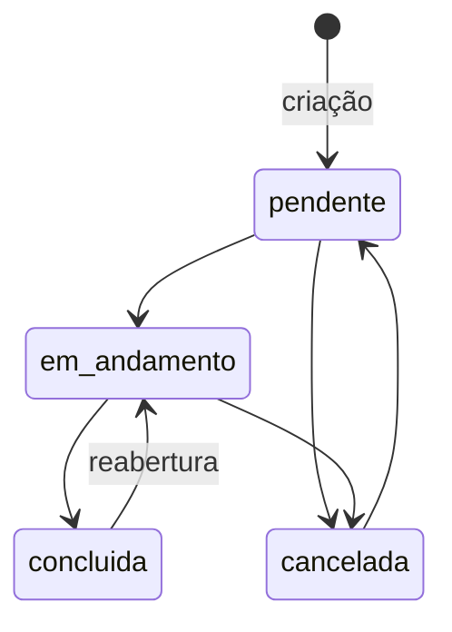

# 001 — Solicitações de Divulgação

| | |
|---|---|
| **ID** | 001 |
| **Status** | Implementada |
| **Atores** | Solicitante (público), Membro da comunicação |
| **Depende de** | [003 — Autenticação](003-autenticacao-e-contas.md) |
| **Relacionada** | [002 — Acompanhamento público](002-acompanhamento-publico.md) |
| **Última revisão** | 2026-07-29 |

## Objetivo

Dar a qualquer ministério da igreja um canal único e rastreável para pedir divulgação de um
evento, e dar à equipe de comunicação um lugar para tocar esses pedidos até a conclusão —
substituindo os pedidos soltos em grupos de WhatsApp.

## Fora de escopo

- Notificação por e-mail, push ou WhatsApp ao mudar o status.
- Upload de arquivo (arte, referência visual).
- Atribuição de responsável por solicitação.
- Prazo/SLA calculado ou alerta de atraso.
- Edição do conteúdo da solicitação depois de criada (só o status muda).

## Histórias de usuário

**HU-1.** Como líder de um ministério, quero enviar um pedido de divulgação sem precisar de
login, para que pedir seja tão fácil quanto mandar mensagem.

**HU-2.** Como líder, quero receber um número de protocolo, para que eu possa acompanhar o
pedido depois.

**HU-3.** Como líder, quero ser avisado se meu ministério já tem evento naquela data, para
que dois pedidos concorrentes não sejam criados por engano.

**HU-4.** Como membro da comunicação, quero ver todas as solicitações filtradas por status,
para que eu saiba o que está pendente.

**HU-5.** Como membro, quero quebrar uma solicitação em subtarefas e comentar o andamento,
para que o time todo enxergue onde o trabalho está.

## Requisitos

| ID | Requisito | Origem |
|---|---|---|
| RF-SOL-001 | O sistema DEVE aceitar a criação de solicitação **sem autenticação** | HU-1 |
| RF-SOL-002 | O sistema DEVE exigir: nome do solicitante, ministério, tipo de evento, nome do evento, data, horário, descrição e tipo de divulgação | HU-1 |
| RF-SOL-003 | O sistema DEVE oferecer a lista de ministérios de `MINISTRIES` e permitir informar um ministério fora da lista | HU-1 |
| RF-SOL-004 | O sistema DEVE recusar (409) a criação quando já existir solicitação **não cancelada** do mesmo ministério na mesma data, devolvendo o evento conflitante | HU-3 |
| RF-SOL-005 | O sistema DEVE criar toda solicitação com status `pendente` e `createdAt` do servidor | HU-2 |
| RF-SOL-006 | O sistema DEVE devolver o `id` (protocolo) na criação e exibi-lo ao solicitante | HU-2 |
| RF-SOL-007 | O sistema DEVE listar todas as solicitações apenas para usuários autenticados, mais recentes primeiro | HU-4 |
| RF-SOL-008 | O sistema DEVE permitir a qualquer usuário autenticado mudar o status para `pendente`, `em_andamento`, `concluida` ou `cancelada` | HU-4 |
| RF-SOL-009 | O sistema DEVE permitir criar, marcar/desmarcar e remover subtarefas de uma solicitação (autenticado) | HU-5 |
| RF-SOL-010 | O sistema DEVE permitir comentar numa solicitação (autenticado), registrando como autor o **nome da sessão** | HU-5 |
| RF-SOL-011 | O sistema NÃO DEVE aceitar `authorName` vindo do corpo do request | HU-5 |
| RNF-SOL-001 | A criação pública DEVE estar sujeita ao rate limit geral da API (600 req / 15 min por IP) | — |
| RNF-SOL-002 | Toda mensagem de erro DEVE ser em português e explicar o que fazer | [Artigo IX](../constitution.md) |

## Regras de negócio

### RN-1 — Conflito é por ministério + data, não por evento
Duas solicitações do **mesmo ministério** na **mesma data** são tratadas como conflito, mesmo
que os eventos tenham nomes diferentes.
**Por quê:** o caso real que motivou a regra é dois líderes do mesmo ministério pedindo a
divulgação do mesmo evento sem saber um do outro. Comparar nome de evento não pegaria isso
("Culto de Celebração" vs "Celebração"). Data + ministério pega, e o falso positivo (um
ministério com dois eventos legítimos no mesmo dia) é raro e resolvível falando com a
comunicação — a mensagem de erro diz isso.

### RN-2 — Cancelada libera a data
A consulta de conflito filtra `status <> "cancelada"`.
**Por quê:** cancelar é a forma de desfazer um pedido; se a data continuasse travada, o
cancelamento não resolveria nada.

### RN-3 — Qualquer membro toca a solicitação adiante
Mudar status, criar subtarefa e comentar exigem apenas login, **não** admin.
**Por quê:** o gargalo do processo é o trabalho de comunicação, não a governança. Exigir
admin para marcar uma subtarefa concluída faria o time voltar ao WhatsApp.

### RN-4 — O autor do comentário vem da sessão
`authorName` é sobrescrito com o `displayName` do usuário autenticado.
**Por quê:** aceitar do corpo permitiria comentar como outra pessoa. O histórico de uma
solicitação só vale se a autoria for confiável.

### RN-5 — Sem máquina de estados
Qualquer transição entre os quatro status é aceita, inclusive voltar de `concluida` para
`pendente`.
**Por quê:** o processo real não é linear (um pedido "concluído" volta quando o líder pede
ajuste). Impor um grafo criaria atrito sem ganho.

### RN-6 — O conteúdo da solicitação é imutável
Não há rota para editar os campos do pedido depois de criado.
**Por quê:** o pedido é o registro do que foi pedido. Ajustes viram comentário, o que
preserva o histórico.

## Estados

Todas as transições entre os quatro estados são permitidas (RN-5); o diagrama mostra as
usuais.

## Critérios de aceite

**CA-1** (RF-SOL-004) — conflito
- **Dado** uma solicitação do ministério "Louvor" em 2026-08-10 com status `pendente`
- **Quando** alguém enviar outra solicitação de "Louvor" para 2026-08-10
- **Então** a API responde 409 com `message` citando ministério e data, e `conflictingEvent`
  com a solicitação existente, e **nada é criado**

**CA-2** (RN-2) — cancelada libera
- **Dado** que a solicitação anterior está `cancelada`
- **Quando** alguém enviar outra de "Louvor" para 2026-08-10
- **Então** a criação é aceita (201)

**CA-3** (RF-SOL-006) — protocolo
- **Quando** a criação é aceita
- **Então** a tela mostra o número do protocolo e um caminho para a página de acompanhamento

**CA-4** (RF-SOL-007) — listagem privada
- **Dado** um visitante sem sessão
- **Quando** chamar `GET /api/requests`
- **Então** recebe 401

**CA-5** (RF-SOL-010, RF-SOL-011) — autoria
- **Dado** um usuário autenticado como "Lucas Almeida"
- **Quando** postar um comentário com `authorName: "Outra Pessoa"` no corpo
- **Então** o comentário é gravado com `authorName: "Lucas Almeida"`

**CA-6** (RF-SOL-008) — status inválido
- **Quando** um usuário autenticado enviar `{ "status": "arquivada" }`
- **Então** a API responde 400 com "Status inválido"

## Contrato

`POST /api/requests` 🌐 · `GET /api/requests` 🔒 · `GET /api/requests/:id` 🌐 ·
`PATCH /api/requests/:id/status` 🔒 · subtarefas e comentários — detalhes em
[`../architecture/api-contract.md`](../architecture/api-contract.md).

## Fontes na implementação

| Camada | Arquivo | Símbolo |
|---|---|---|
| Tipos e schemas | [`shared/schema.ts`](../../shared/schema.ts) | `requests`, `subtasks`, `comments`, `insertRequestSchema`, `MINISTRIES` |
| API | [`server/routes.ts`](../../server/routes.ts) | blocos `── Requests ──`, `── Subtasks ──`, `── Comments ──` |
| Persistência | [`server/storage-dynamo.ts`](../../server/storage-dynamo.ts) | `getRequestsByMinistryAndDate` (GSI `ministry-date-index`) |
| UI — formulário público | [`client/src/pages/solicitacoes.tsx`](../../client/src/pages/solicitacoes.tsx) | `Solicitacoes` |
| UI — painel interno | [`client/src/pages/painel.tsx`](../../client/src/pages/painel.tsx) | `Painel`, `RequestList`, `RequestDetail` |

## Dívidas e lacunas

- `eventType`, `promotionType` e `status` não são enums Zod; só o formulário do cliente
  restringe `eventType`/`promotionType`. Um POST direto grava qualquer string.
- Mudança de status não é auditada.
- O painel faz `refetchInterval: 5000` — polling, não realtime.
- O tratamento do 409 no cliente inspeciona a string do erro (`msg.includes("409")`), o que
  é frágil.

Ver [`../backlog.md`](../backlog.md).
