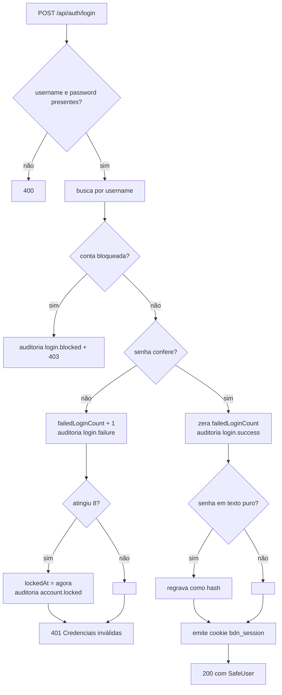

# 003 — Autenticação, Contas e Permissões

| | |
|---|---|
| **ID** | 003 |
| **Status** | Implementada |
| **Atores** | Membro da comunicação, Administrador, Conta raiz |
| **Depende de** | — |
| **Relacionada** | [004 — Perfil do membro](004-perfil-do-membro.md), [007 — Trilha de auditoria](007-trilha-de-auditoria.md) |
| **Última revisão** | 2026-07-29 |

> O **porquê** de cada decisão desta spec está detalhado em
> [`../architecture/security.md`](../architecture/security.md). Aqui fica o **comportamento
> esperado**.

## Objetivo

Controlar quem entra no sistema e o que cada um pode fazer, sabendo que: a equipe é pequena
e fechada, não há e-mail transacional, e não há ninguém de plantão para socorrer quem se
tranca do lado de fora — exceto outro administrador.

## Fora de escopo

- Autocadastro. Contas são criadas por administradores.
- Recuperação de senha por e-mail ou SMS.
- SSO / OAuth / login social.
- Segundo fator (2FA).
- RBAC granular. Só existem dois níveis: usuário e admin.
- Sessões nomeadas / "desconectar de outros dispositivos" como ação explícita.

## Histórias de usuário

**HU-1.** Como membro, quero entrar com usuário e senha e continuar logado por um tempo
razoável, para não digitar senha toda hora.

**HU-2.** Como administrador, quero criar contas para novos membros e definir uma senha
inicial, para colocá-los no sistema no mesmo dia.

**HU-3.** Como membro que recebeu senha de um admin, quero (e devo) trocá-la antes de usar o
sistema, para que ninguém além de mim conheça minha senha.

**HU-4.** Como administrador, quero que contas sob ataque de senha fiquem bloqueadas, para
que ninguém entre por tentativa e erro.

**HU-5.** Como administrador, quero desbloquear e redefinir a senha de quem se trancou fora.

**HU-6.** Como responsável pelo sistema, quero que a conta de recuperação (`admin`) não
possa ser tomada por um administrador comum comprometido.

## Requisitos

### Sessão

| ID | Requisito |
|---|---|
| RF-AUT-001 | O sistema DEVE autenticar por usuário e senha em `POST /api/auth/login` |
| RF-AUT-002 | O sistema DEVE emitir a sessão como JWT HS256 em cookie `HttpOnly`, `SameSite=strict`, `Secure` em produção, com validade de 12 horas |
| RF-AUT-003 | O sistema NÃO DEVE devolver o token no corpo da resposta |
| RF-AUT-004 | O sistema DEVE recarregar o usuário do banco a cada request autenticado |
| RF-AUT-005 | O sistema DEVE invalidar todos os tokens emitidos antes de uma troca de senha |
| RF-AUT-006 | O sistema DEVE recusar (401) requests de conta bloqueada, mesmo com token válido |
| RF-AUT-007 | O logout DEVE apagar o cookie de sessão |
| RNF-AUT-001 | Em produção, o sistema NÃO DEVE iniciar sem `JWT_SECRET` de pelo menos 32 caracteres |

### Senha

| ID | Requisito |
|---|---|
| RF-AUT-010 | A senha DEVE ter no mínimo 10 caracteres |
| RF-AUT-011 | O sistema DEVE recusar senhas de uma lista de valores óbvios |
| RF-AUT-012 | O sistema DEVE recusar senha igual ao nome de usuário |
| RF-AUT-013 | O sistema DEVE armazenar senhas com `scrypt` e salt por usuário |
| RF-AUT-014 | O sistema DEVE aceitar senha legada em texto puro e regravá-la como hash no primeiro login bem-sucedido |
| RF-AUT-015 | A mesma política DEVE ser aplicada na criação, na troca pelo dono e no reset por admin |
| RF-AUT-016 | O cliente DEVE avisar sobre violação da política antes do envio, usando a **mesma função** do servidor |

### Bloqueio

| ID | Requisito |
|---|---|
| RF-AUT-020 | O sistema DEVE contar senhas erradas consecutivas por conta |
| RF-AUT-021 | Ao atingir 8 erros consecutivos, a conta DEVE ser bloqueada **permanentemente** |
| RF-AUT-022 | Um login bem-sucedido DEVE zerar o contador |
| RF-AUT-023 | Tentativa em conta bloqueada DEVE responder 403 com mensagem explicando o bloqueio e o caminho (procurar um admin) |
| RF-AUT-024 | Qualquer administrador DEVE poder desbloquear qualquer conta, **inclusive a raiz** |
| RF-AUT-025 | Um reset de senha DEVE também desbloquear a conta e zerar o contador |
| RNF-AUT-002 | O login DEVE ser limitado a 30 falhas/15 min por IP e 10 falhas/15 min por conta |

### Contas e permissões

| ID | Requisito |
|---|---|
| RF-AUT-030 | Apenas administradores DEVEM criar, remover, promover, rebaixar, desbloquear ou resetar senha de contas |
| RF-AUT-031 | Contas criadas por admin DEVEM nascer com `mustChangePassword = true` |
| RF-AUT-032 | O sistema DEVE recusar (409) criação com `username` já existente |
| RF-AUT-033 | O sistema NÃO DEVE aceitar `isAdmin`, `mustChangePassword`, `failedLoginCount` ou `lockedAt` vindos do corpo em rotas de perfil |
| RF-AUT-034 | Usuário comum DEVE ver apenas `id`, `username`, `displayName`, `isAdmin` e `roles` dos demais |
| RF-AUT-035 | Nenhuma resposta DEVE conter o campo `password` |
| RF-AUT-036 | O sistema NÃO DEVE permitir alterar `username` |

### Conta raiz

| ID | Requisito |
|---|---|
| RF-AUT-040 | O usuário `admin` NÃO DEVE poder ser removido |
| RF-AUT-041 | O usuário `admin` NÃO DEVE poder deixar de ser administrador |
| RF-AUT-042 | A senha do `admin` só DEVE poder ser redefinida por ele mesmo |
| RF-AUT-043 | Qualquer admin DEVE poder desbloquear o `admin` |

## Regras de negócio

### RN-1 — O token carrega a impressão digital da senha
O claim `pv` é um hash truncado do hash da senha. Se a senha muda, todos os tokens antigos
deixam de casar.
**Por quê:** revogação sem estado. Uma lista de revogação exigiria armazenamento
compartilhado entre invocações de Lambda — que não existe.

### RN-2 — Bloquear a conta derruba as sessões abertas
`isLocked` é checado no middleware, não só no login.
**Por quê:** sem isso, a sessão do atacante sobreviveria justamente ao bloqueio que existe
por causa dele.

### RN-3 — O bloqueio é permanente
Não há prazo que destrave sozinho.
**Por quê:** bloqueio temporário devolve ao atacante a chance de voltar quando a janela
virar. O custo — um admin precisa agir — é aceitável num time pequeno.
Ver [ADR-0004](../decisions/ADR-0004-bloqueio-permanente-de-conta.md).

### RN-4 — A mensagem de conta bloqueada entrega que a conta existe
**Por quê:** quem está trancado do lado de fora precisa saber por quê e a quem pedir. O
bloqueio já tira o valor da enumeração — a conta não abre de qualquer forma. Falha comum de
login continua com mensagem única ("Credenciais inválidas") para conta inexistente e senha
errada.

### RN-5 — Quem define a senha não deve ser quem a usa
Senha definida por admin ⇒ `mustChangePassword = true`; senha escolhida pelo próprio dono
⇒ `false`. Se um admin redefine **a própria** senha, não há nada a forçar.
**Por quê:** o admin conhece a senha que digitou. Enquanto o dono não trocar, duas pessoas
têm a credencial.

### RN-6 — Só falhas contam no rate limit por IP
`skipSuccessfulRequests: true` no limitador de IP.
**Por quê:** a equipe inteira sai do mesmo IP depois do NAT (wi-fi da igreja). Login certo
de um não pode gastar a cota do outro. Para quem adivinha senha nada muda — todo palpite
errado queima cota.

### RN-7 — A conta raiz é a via de recuperação
Ver [ADR-0005](../decisions/ADR-0005-conta-raiz-admin.md). Se a senha da raiz for perdida e
ninguém puder redefini-la, a saída é um `update-item` direto no DynamoDB — documentado em
[`../guides/deployment.md`](../guides/deployment.md).

### RN-8 — A trava de senha provisória é de interface
O cliente redireciona para `/#/usuarios` quem tem `mustChangePassword`, mas a API continua
aceitando as demais operações desse usuário.
**Por quê:** foi implementado como empurrão de UX. **Não descreva como controle de
segurança.** Tornar a trava efetiva no servidor está no [`../backlog.md`](../backlog.md).

## Fluxo de login

## Critérios de aceite

**CA-1** (RF-AUT-002, RF-AUT-003)
- **Quando** o login for bem-sucedido
- **Então** a resposta traz `Set-Cookie: bdn_session` com `HttpOnly` e `SameSite=Strict`, e o
  corpo **não** contém token algum

**CA-2** (RF-AUT-005)
- **Dado** um usuário logado em dois dispositivos
- **Quando** ele trocar a senha no dispositivo A
- **Então** o dispositivo B recebe 401 no próximo request, e A continua na sessão (o cookie
  é reemitido)

**CA-3** (RF-AUT-006, RN-2)
- **Dado** um usuário com sessão aberta
- **Quando** a conta dele for bloqueada
- **Então** o próximo request dele responde 401

**CA-4** (RF-AUT-021, RF-AUT-023)
- **Dado** uma conta com 7 falhas consecutivas
- **Quando** houver a 8ª senha errada
- **Então** `lockedAt` é preenchido, a auditoria registra `account.locked`, e a próxima
  tentativa — **mesmo com a senha correta** — responde 403 com a mensagem de bloqueio

**CA-5** (RF-AUT-022)
- **Dado** uma conta com 3 falhas
- **Quando** o login acertar
- **Então** `failedLoginCount` volta a 0

**CA-6** (RF-AUT-042)
- **Dado** um admin comum autenticado
- **Quando** chamar `POST /api/users/<id da raiz>/reset-password`
- **Então** recebe 403 e a senha da raiz não muda

**CA-7** (RF-AUT-040, RF-AUT-041)
- **Quando** um admin tentar apagar a raiz ou desligar o `isAdmin` dela
- **Então** recebe 403 nos dois casos

**CA-8** (RF-AUT-043)
- **Dado** a conta raiz bloqueada
- **Quando** qualquer admin chamar `POST /api/users/<id da raiz>/unlock`
- **Então** a conta é desbloqueada

**CA-9** (RF-AUT-031, RN-5)
- **Dado** uma conta recém-criada por um admin
- **Quando** o dono fizer o primeiro login
- **Então** `mustChangePassword` é `true` e o app o leva a `/#/usuarios`; após a troca, a
  flag some

**CA-10** (RF-AUT-010, RF-AUT-016)
- **Quando** alguém digitar uma senha de 8 caracteres em qualquer formulário de senha
- **Então** a mensagem de política aparece **antes** do envio e a API também recusaria (400)

**CA-11** (RF-AUT-034)
- **Dado** um usuário comum autenticado
- **Quando** chamar `GET /api/users`
- **Então** nenhum item traz `email`, `phone`, `cellName` ou `cellLeaders`

**CA-12** (RNF-AUT-001)
- **Dado** `NODE_ENV=production` sem `JWT_SECRET` válido
- **Quando** o processo iniciar
- **Então** ele falha com erro explícito, em vez de subir com segredo fraco

## Contrato

`POST /api/auth/login`, `POST /api/auth/logout`, `GET /api/auth/me`, `GET /api/users`,
`POST /api/users`, `POST /api/users/:id/reset-password`, `POST /api/users/:id/unlock`,
`PATCH /api/users/:id/admin`, `PATCH /api/users/:id/roles`, `DELETE /api/users/:id` —
[`../architecture/api-contract.md`](../architecture/api-contract.md).

## Fontes na implementação

| Camada | Arquivo | Símbolo |
|---|---|---|
| Regras compartilhadas | [`shared/schema.ts`](../../shared/schema.ts) | `passwordIssue`, `PASSWORD_MIN_LENGTH`, `MAX_FAILED_LOGINS`, `isLocked`, `isRootAdmin`, `ROOT_ADMIN_USERNAME`, `adminCreateUserSchema`, `changePasswordSchema`, `adminResetPasswordSchema` |
| Sessão | [`server/tokens.ts`](../../server/tokens.ts) | `signToken`, `verifyToken`, `matchesCurrentPassword`, `setSessionCookie`, `resolveSecret` |
| Hash | [`server/password.ts`](../../server/password.ts) | `hashPassword`, `verifyPassword`, `isHashed` |
| API | [`server/routes.ts`](../../server/routes.ts) | `requireUser`, `requireAdmin`, `resolveRequestUser`, rotas `── Auth ──` e `── Users ──` |
| UI — login | [`client/src/pages/login.tsx`](../../client/src/pages/login.tsx) | `Login` |
| UI — gestão | [`client/src/pages/equipes.tsx`](../../client/src/pages/equipes.tsx) | `CreateUserForm`, `UserList`, `ResetPasswordDialog` |
| UI — trava | [`client/src/App.tsx`](../../client/src/App.tsx) | `PasswordChangeGate`, `GATED_PATHS` |
| Sessão no cliente | [`client/src/lib/auth.ts`](../../client/src/lib/auth.ts) | `useAuth`, `loadStoredSession`, `clearSession` |

## Dívidas e lacunas

- A trava de senha provisória é só de UI (RN-8).
- Um admin pode revogar o próprio `isAdmin` pela API (a UI desabilita o switch, o servidor
  não impede) — é possível ficar sem nenhum admin além da raiz.
- `PATCH /api/users/:id/roles` não gera entrada de auditoria.
- O fallback `Authorization: Bearer` em `readToken` é migração temporária e deveria sair.
- Não há tela para ler a trilha de auditoria — ver [spec 007](007-trilha-de-auditoria.md).

Ver [`../backlog.md`](../backlog.md).
