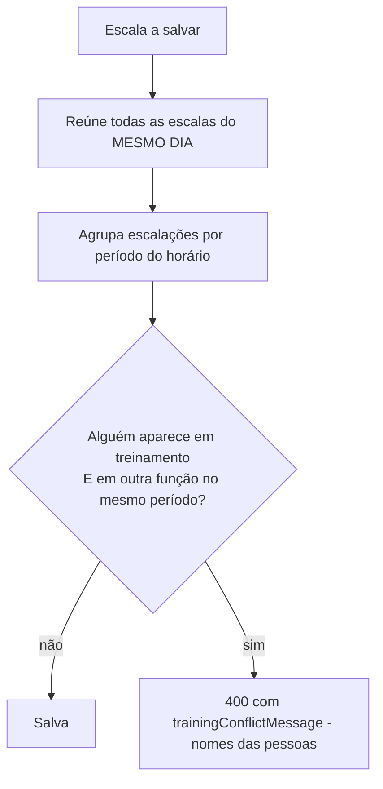

# 005 — Escalas de Voluntários

| | |
|---|---|
| **ID** | 005 |
| **Status** | Implementada |
| **Atores** | Voluntário, Administrador |
| **Depende de** | [003 — Autenticação](003-autenticacao-e-contas.md) |
| **Relacionada** | [006 — Geração automática](006-geracao-automatica-de-escalas.md), [008 — Lembretes de escala](008-lembretes-de-escala.md) |
| **Última revisão** | 2026-07-31 |

## Objetivo

Organizar quem cobre cada função de comunicação em cada culto ou evento: definir as funções
de cada voluntário, deixar que cada um registre quando não pode servir, montar as escalas, e
avisar o admin quando alguém estiver sobrecarregado ou numa combinação proibida.

## Fora de escopo

- Confirmação/aceite do voluntário ("confirmo presença").
- Troca de escala entre voluntários (swap) dentro do sistema.
- Notificação de escala — passou a existir na
  [spec 008](008-lembretes-de-escala.md), por notificação push do navegador. Envio por
  WhatsApp/e-mail continua fora de escopo
  ([ADR-0008](../decisions/ADR-0008-web-push-para-lembretes.md)).
- Mais de um voluntário na mesma função no mesmo evento — a estrutura de formulário permite
  **um por função**.
- Escala recorrente que se reprocessa sozinha (a geração é um ato pontual).

## Histórias de usuário

**HU-1.** Como administrador, quero marcar quais funções cada pessoa exerce, para que só
gente habilitada seja escalada naquela função.

**HU-2.** Como voluntário, quero registrar os dias — ou só os períodos — em que não posso
servir, para não ser escalado neles.

**HU-3.** Como administrador, quero criar e editar escalas manualmente, escolhendo quem faz
o quê em cada culto.

**HU-4.** Como administrador, quero ser avisado ao escolher alguém indisponível ou já
sobrecarregado, para redistribuir antes de salvar.

**HU-5.** Como administrador, quero escalar alguém "em treinamento", para que essa pessoa
acompanhe a equipe sem ser responsável por um posto.

**HU-6.** Como voluntário, quero ver minhas próximas escalas e as da equipe, para me
organizar.

## Requisitos

### Funções da equipe

| ID | Requisito | Origem |
|---|---|---|
| RF-ESC-001 | As funções DEVEM ser exatamente: fotografia, filmmaker, projeção, transmissão ao vivo e treinamento | — |
| RF-ESC-002 | Apenas administradores DEVEM poder alterar as funções de um usuário | HU-1 |
| RF-ESC-003 | Usuário com pelo menos uma função DEVE ser considerado voluntário e ser elegível a escalas | HU-1 |
| RF-ESC-004 | Usuário sem função NÃO DEVE aparecer como opção nas escalas | HU-1 |

### Indisponibilidade

| ID | Requisito | Origem |
|---|---|---|
| RF-ESC-010 | O voluntário DEVE poder registrar indisponibilidade informando data e período (manhã, tarde, noite ou dia inteiro) | HU-2 |
| RF-ESC-011 | Sem período informado, o registro DEVE valer para o dia inteiro | HU-2 |
| RF-ESC-012 | O registro DEVE ser sempre para o próprio usuário (`userId` vem da sessão) | HU-2 |
| RF-ESC-013 | O voluntário DEVE poder remover a própria indisponibilidade; o admin, a de qualquer um | HU-2 |
| RF-ESC-014 | Administradores DEVEM ver as entradas de todos; usuários comuns, apenas as próprias | HU-2 |
| RF-ESC-015 | Registrar "dia inteiro" DEVE absorver os períodos já registrados naquela data | HU-2 |
| RF-ESC-016 | Registrar um período já coberto NÃO DEVE criar duplicata | HU-2 |

### Escalas

| ID | Requisito | Origem |
|---|---|---|
| RF-ESC-020 | Apenas administradores DEVEM criar, editar ou apagar escalas | HU-3 |
| RF-ESC-021 | Qualquer usuário autenticado DEVE poder ver as escalas | HU-6 |
| RF-ESC-022 | A escala DEVE ter título, tipo (`culto` ou `especial`), data, horário, observações opcionais e a lista de escalações | HU-3 |
| RF-ESC-023 | Cada escalação DEVE conter função, id e **nome** do voluntário | HU-3 |
| RF-ESC-024 | O formulário DEVE avisar ao escolher alguém com indisponibilidade **no período daquele horário** | HU-4 |
| RF-ESC-025 | O formulário DEVE avisar ao escolher alguém com 4 ou mais escalas no mês da data escolhida | HU-4 |
| RF-ESC-026 | O aviso de sobrecarga DEVE contar a própria escala em edição | HU-4 |
| RF-ESC-027 | O voluntário DEVE ver, em destaque, apenas as próprias escalas futuras | HU-6 |
| RF-ESC-028 | A lista padrão DEVE mostrar apenas escalas de hoje em diante, com opção de exibir as anteriores | HU-6 |

### Treinamento

| ID | Requisito | Origem |
|---|---|---|
| RF-ESC-030 | Quem estiver escalado em treinamento NÃO DEVE ocupar outra função **no mesmo período do mesmo dia** | HU-5 |
| RF-ESC-031 | A restrição DEVE ser imposta pela API em criação, edição e criação em lote | HU-5 |
| RF-ESC-032 | O formulário DEVE impedir a escolha proibida antes do envio, explicando o motivo | HU-5 |
| RF-ESC-033 | A restrição DEVE considerar **todas** as escalas do mesmo dia, agrupadas por período | HU-5 |
| RF-ESC-034 | O treinamento DEVE ser apresentado visualmente como diferente das funções operacionais | HU-5 |

## Regras de negócio

### RN-1 — Função ≠ permissão
`roles` define **o que a pessoa sabe fazer**, não o que ela pode acessar. Permissão é só
`isAdmin`.
**Por quê:** confundir os dois levaria a "quem é da transmissão pode editar escalas", o que
não é verdade — e criaria um sistema de permissões que ninguém pediu.

### RN-2 — Período vem do horário, não do campo
O período de um evento é derivado de `eventTime` por `periodOfTime`: manhã < 12h,
tarde < 18h, noite ≥ 18h.
**Por quê:** um campo separado de período poderia divergir do horário. Derivar garante que
mudar o horário reavalie automaticamente indisponibilidades e conflitos de treinamento.

### RN-3 — "Dia inteiro" cobre os três períodos, mas não é um deles
`UNAVAILABILITY_PERIODS` inclui `"dia"`; `EVENT_PERIODS` não.
**Por quê:** um culto acontece num período específico; a indisponibilidade é que pode ser
ampla. `blocksPeriod(entry, event)` faz a ponte.

### RN-4 — Cada culto tem seu próprio balanço de período
Domingo de manhã e domingo à noite são escalas independentes, com rosters independentes.
**Por quê:** quem treina no culto da manhã continua livre para servir à tarde ou à noite do
mesmo dia. Bloquear o dia inteiro tiraria voluntários de circulação sem necessidade.

### RN-5 — Treinamento não é um posto de trabalho
Quem está em treinamento está aprendendo ao lado de quem já sabe — não pode ser contado como
responsável por uma função ao mesmo tempo.
**Por quê:** era o erro que a escala manual cometia: colocar o aprendiz também na projeção,
o que anula o treinamento. Ver
[ADR-0006](../decisions/ADR-0006-treinamento-como-funcao-de-escala.md).

### RN-6 — O nome do voluntário é congelado na escalação
`volunteerName` é gravado junto com o `volunteerId`.
**Por quê:** leitura sem join e preservação do histórico. Consequência conhecida: renomear
alguém não atualiza escalas já criadas.

### RN-7 — Sobrecarga é aviso, não bloqueio
`OVERLOAD_THRESHOLD = 4` escalas no mesmo mês dispara um aviso visível **apenas ao admin**.
**Por quê:** há domingos em que só uma pessoa cobre a função. Bloquear travaria o trabalho;
avisar dá ao admin a informação para redistribuir se puder. Quem monta a escala é quem pode
decidir.

### RN-8 — Duas funções no mesmo evento contam como uma escala
`monthlyLoadByVolunteer` deduplica por evento.
**Por quê:** a carga real é "quantos cultos você serviu", não "quantas caixinhas você
preencheu".

### RN-9 — Meses passados não entram no aviso
`overloadedMonths` ignora meses anteriores ao mês de referência.
**Por quê:** o aviso existe para provocar ação. Sobrecarga de março não tem conserto em
julho.

## Fluxo do conflito de treinamento

O cliente roda a mesma verificação (mesmas funções de `shared/schema.ts`) para bloquear a
escolha antes do envio; a API tem a palavra final.

## Critérios de aceite

**CA-1** (RF-ESC-003, RF-ESC-004)
- **Dado** um usuário sem nenhuma função
- **Quando** o admin abrir o formulário de escala
- **Então** ele não aparece em nenhum seletor de função

**CA-2** (RF-ESC-024, RN-2)
- **Dado** que Mariana registrou indisponibilidade em 2026-08-09 no período `manha`
- **Quando** o admin montar uma escala em 2026-08-09 às `10:00` e escolher Mariana
- **Então** aparece o aviso "indisponível de manhã"
- **E quando** o horário for alterado para `18:00`
- **Então** o aviso desaparece

**CA-3** (RF-ESC-015, RF-ESC-016)
- **Dado** entradas `manha` e `noite` de um voluntário em 2026-08-09
- **Quando** ele registrar `dia` na mesma data
- **Então** as duas anteriores são removidas e resta apenas a entrada `dia`
- **E quando** registrar `tarde` depois disso
- **Então** nada é criado e a entrada `dia` é devolvida

**CA-4** (RF-ESC-030, RF-ESC-031)
- **Dado** uma escala em 2026-08-09 às `10:00` com Ana em `treinamento`
- **Quando** o admin criar outra escala em 2026-08-09 às `11:00` com Ana em `fotografia`
- **Então** a API responde 400 com "Ana … está em treinamento e não pode assumir outra
  função no mesmo período."

**CA-5** (RN-4)
- **Dado** o mesmo cenário
- **Quando** a segunda escala for às `19:00` (noite)
- **Então** a criação é aceita

**CA-6** (RF-ESC-025, RF-ESC-026, RN-8)
- **Dado** um voluntário com 3 escalas em agosto/2026
- **Quando** o admin montar uma quarta escala em agosto e selecioná-lo
- **Então** aparece o aviso de sobrecarga já contando a escala em edição (4)

**CA-7** (RF-ESC-012)
- **Quando** um usuário enviar `POST /api/unavailability` com `userId` de outra pessoa no corpo
- **Então** o registro é criado para **ele mesmo** (o corpo é ignorado nesse campo)

**CA-8** (RF-ESC-014)
- **Dado** um usuário comum
- **Quando** chamar `GET /api/unavailability`
- **Então** recebe apenas as próprias entradas

**CA-9** (RF-ESC-020)
- **Dado** um usuário comum autenticado
- **Quando** chamar `POST /api/schedules`
- **Então** recebe 403

**CA-10** (RF-ESC-027, RF-ESC-028)
- **Dado** escalas passadas e futuras
- **Quando** o voluntário abrir a página
- **Então** vê apenas as futuras; "Minhas próximas escalas" traz só aquelas em que ele
  aparece

## Interface

### Aba "Voluntário" (todo usuário autenticado)
1. **Minhas próximas escalas** — cartões com data, horário, título, funções e observações.
2. **Minha disponibilidade** — data + período + botão adicionar; entradas futuras como
   badges removíveis.
3. **Próximas escalas da equipe** — todas as escalas futuras, com o próprio nome destacado.

### Aba "Administração" (somente admin)
1. **Funções da equipe** (`TeamRolesManager`) — checkbox por função e por pessoa, com
   indisponibilidades próximas e aviso de sobrecarga.
2. **Nova escala** (`ScheduleFormDialog`) — um seletor por função, com avisos inline de
   indisponibilidade, sobrecarga e bloqueio por treinamento.
3. **Gerar automaticamente** (`AutoGenerateDialog`) — ver [spec 006](006-geracao-automatica-de-escalas.md).
4. **Lista de escalas** — cartões com edição/remoção e opção "Mostrar anteriores".

Cores e ícones por função vivem em `ROLE_ICONS` e `ROLE_BADGE_CLASSES`
([`client/src/lib/escalas.ts`](../../client/src/lib/escalas.ts)); o treinamento usa borda
tracejada e cor neutra **de propósito** (RF-ESC-034).

A lista de escalas faz `refetchInterval: 10000` — dois admins montando ao mesmo tempo se
enxergam com até 10 s de atraso.

## Contrato

`GET/POST/PUT/DELETE /api/schedules*`, `GET/POST/DELETE /api/unavailability*`,
`PATCH /api/users/:id/roles` —
[`../architecture/api-contract.md`](../architecture/api-contract.md).

## Fontes na implementação

| Camada | Arquivo | Símbolo |
|---|---|---|
| Domínio compartilhado | [`shared/schema.ts`](../../shared/schema.ts) | `SCHEDULE_ROLES`, `OPERATIONAL_ROLES`, `TRAINING_ROLE`, `isTrainingRole`, `periodOfTime`, `UNAVAILABILITY_PERIODS`, `EVENT_PERIODS`, `trainingConflicts`, `trainingConflictMessage`, `unavailabilityPeriod` |
| Regras de UI | [`client/src/lib/escalas.ts`](../../client/src/lib/escalas.ts) | `blocksPeriod`, `rosterOfPeriod`, `blockedNote`, `monthlyLoadByVolunteer`, `overloadedMonths`, `OVERLOAD_THRESHOLD` |
| API | [`server/routes.ts`](../../server/routes.ts) | `trainingIssue`, blocos `── Unavailability ──` e `── Schedules ──` |
| Persistência | [`server/storage-dynamo.ts`](../../server/storage-dynamo.ts) | `createUnavailability`, `getAllSchedules`, `updateSchedule` |
| UI — página | [`client/src/pages/escalas.tsx`](../../client/src/pages/escalas.tsx) | `Escalas`, `VolunteerView`, `MyAvailability`, `AdminView` |
| UI — componentes | [`client/src/components/escalas/`](../../client/src/components/escalas/) | `ScheduleCard`, `ScheduleFormDialog`, `TeamRolesManager`, `OverloadWarning` |

## Dívidas e lacunas

- Um voluntário por função e por evento: o formulário indexa a seleção por função
  (`Record<ScheduleRole, string>`), então dois fotógrafos no mesmo culto não são
  representáveis pela UI (o modelo de dados suportaria).
- Apagar um usuário **não** o remove de escalas futuras nem apaga suas indisponibilidades.
- Nenhuma operação de escala é auditada.
- Criação manual pode duplicar `(eventDate, eventTime)` — só a geração automática evita.
- Edição concorrente: o último `PUT` vence, sem detecção de conflito.

Ver [`../backlog.md`](../backlog.md).
