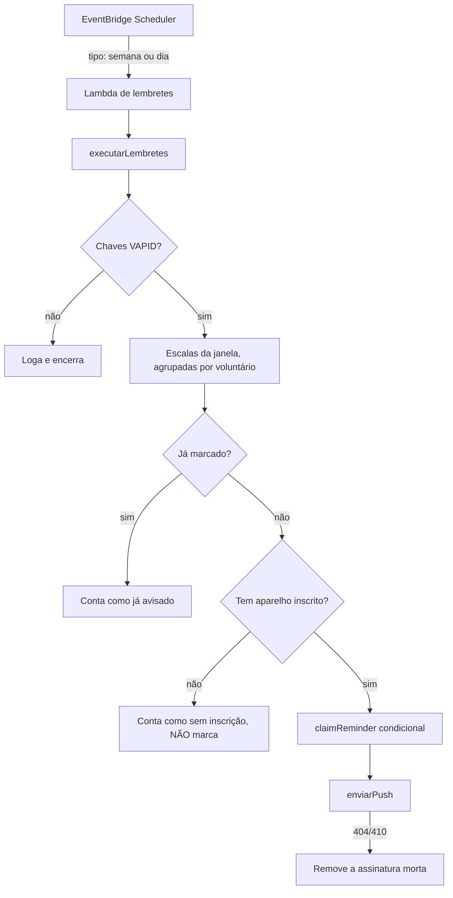

# 008 — Lembretes de escala

| | |
|---|---|
| **ID** | 008 |
| **Status** | Implementada |
| **Atores** | Voluntário escalado, Administrador |
| **Depende de** | [005 — Escalas de voluntários](005-escalas-de-voluntarios.md), [004 — Perfil do membro](004-perfil-do-membro.md) |
| **Última revisão** | 2026-07-31 |

## Objetivo

Avisar automaticamente quem está escalado, sem que a pessoa precise lembrar de abrir o
sistema: uma notificação na segunda-feira da semana em que vai servir e outra na manhã do
próprio dia.

## Fora de escopo

- **Envio por WhatsApp, SMS ou e-mail.** O canal é a notificação do navegador
  ([ADR-0008](../decisions/ADR-0008-web-push-para-lembretes.md)). O que existe para o
  WhatsApp é um link `wa.me` que o **admin** clica — não há integração de mensagens.
- **Confirmação de presença.** O lembrete informa; não pergunta nada nem espera resposta.
- **Escolha de horário por pessoa.** Os dois disparos são fixos para todo o time.
- **Aviso ao admin sobre falha de entrega.** Se a notificação não chegar, ninguém é
  avisado disso ([backlog](../backlog.md)).
- **Lembrete de indisponibilidade, de aniversário ou qualquer outro assunto.** Só escala.

## Histórias de usuário

**HU-1.** Como voluntário, quero ser avisado no começo da semana em que estou escalado, para
que eu consiga me organizar ou pedir troca a tempo.

**HU-2.** Como voluntário, quero um lembrete na manhã do dia em que sirvo, para que eu não
esqueça no corre do dia.

**HU-3.** Como voluntário, quero ligar e desligar esses avisos por conta própria, para que
o sistema não notifique meu celular sem eu ter pedido.

**HU-4.** Como administrador, quero ver quem não vai receber o lembrete automático, para que
eu possa avisar essa pessoa pelo WhatsApp sem depender de decorar quem ativou.

## Requisitos

| ID | Requisito | Origem |
|---|---|---|
| RF-LEM-001 | O sistema DEVE enviar, às segundas-feiras às 09h (America/Sao_Paulo), uma notificação para cada voluntário escalado em alguma escala daquela semana | HU-1 |
| RF-LEM-002 | O sistema DEVE enviar, todos os dias às 07h (America/Sao_Paulo), uma notificação para cada voluntário escalado em alguma escala daquele dia | HU-2 |
| RF-LEM-003 | O sistema DEVE notificar **apenas** os voluntários escalados na janela — nunca a equipe inteira | HU-1, HU-2 |
| RF-LEM-004 | O sistema DEVE agrupar, numa única notificação, todas as escalas do voluntário dentro da janela | HU-1 |
| RF-LEM-005 | O sistema NÃO DEVE enviar o mesmo lembrete duas vezes para o mesmo voluntário na mesma escala | HU-1, HU-2 |
| RF-LEM-006 | O voluntário DEVE poder ativar e desativar as notificações em cada aparelho, a partir do próprio perfil | HU-3 |
| RF-LEM-007 | O voluntário DEVE poder disparar uma notificação de teste para conferir que ela chega | HU-3 |
| RF-LEM-008 | O administrador DEVE ver, no cartão da escala, quais escalados não recebem lembrete automático, com um atalho para avisá-los pelo WhatsApp | HU-4 |
| RF-LEM-009 | O administrador PODE disparar manualmente qualquer um dos dois lembretes | HU-4 |
| RNF-LEM-001 | As assinaturas de push NÃO DEVEM aparecer em nenhuma resposta da API | [Artigo II](../constitution.md) |
| RNF-LEM-002 | Nenhum log DEVE conter telefone, endereço de push ou o conteúdo da notificação | [Artigo II](../constitution.md) |
| RNF-LEM-003 | O sistema DEVE subir e funcionar normalmente sem as chaves VAPID configuradas, apenas sem enviar lembrete | [Artigo I](../constitution.md) |

## Regras de negócio

### RN-1 — A inscrição do aparelho é o consentimento
Não existe campo "quero receber lembretes". Quem manda é a existência de uma assinatura de
push em `users.pushSubscriptions`, criada só depois de a pessoa clicar em ativar e o
navegador pedir a permissão dela.

**Por quê:** um campo separado guardaria a mesma informação duas vezes, e as duas poderiam
discordar — alguém com "quero receber" ligado e a permissão revogada no navegador ficaria
para sempre na lista de quem "deveria" ser avisado, sem nunca ser.

### RN-2 — Uma notificação por voluntário, não por escala
Quem serve no culto da manhã e no da noite do mesmo domingo recebe **uma** notificação
listando as duas escalas, em cada disparo.

**Por quê:** duas notificações seguidas no mesmo minuto são lidas como falha do sistema, e o
navegador pune remetente repetitivo. A alternativa (uma por escala) simplificaria o controle
de duplicidade, mas ao custo da experiência de quem mais serve.

### RN-3 — A marca de envio é gravada antes do envio
Antes de notificar, o sistema grava `${tipo}:${volunteerId}` em `schedules.remindersSent`
com uma escrita condicional; só envia se a gravação for aceita.

**Por quê:** o EventBridge Scheduler reexecuta a Lambda quando ela falha, e uma execução
repetida encontraria a marca e não notificaria de novo. O inverso — enviar e depois marcar —
duplicaria o aviso a cada retentativa. O preço é assimétrico e conhecido: se todos os envios
falharem depois da marca, aquele lembrete se perde. Para um aviso, avisar duas vezes
incomoda mais do que perder um.

### RN-4 — A marca é por voluntário, não por escala inteira
A chave inclui o `volunteerId`.

**Por quê:** escalas são editadas. Se o admin trocar quem serve, o novo escalado precisa
receber o aviso — e quem saiu não pode recebê-lo de novo. Uma marca por escala trataria os
dois casos errado.

### RN-5 — Quem não tem aparelho inscrito não é marcado
Voluntário sem assinatura é contado como "sem inscrição" e **nenhuma** marca é gravada para
ele.

**Por quê:** se a pessoa ativar as notificações ainda hoje, o disparo seguinte a alcança.
Marcar quem não foi notificado a excluiria do lembrete que ela acabou de pedir para receber.

### RN-6 — O que já passou não vira lembrete
A janela sempre começa em "hoje", inclusive num disparo manual no meio da semana.

**Por quê:** o disparo manual existe para reenviar depois de uma falha; ninguém precisa ser
lembrado do culto de anteontem.

### RN-7 — As datas são resolvidas no fuso da igreja
"Hoje" e "esta semana" são calculados em `America/Sao_Paulo`, não em UTC.

**Por quê:** a Lambda roda em UTC, onde "hoje" já virou amanhã depois das 21h de Brasília. O
lembrete das 07h sairia com a data errada em qualquer escala noturna. A semana vai de
segunda a **domingo** porque o domingo é o dia de culto — jogá-lo para a semana seguinte
deixaria o aviso de segunda sem o evento mais importante.

### RN-8 — O telefone continua sendo texto livre
O formulário de perfil **avisa** quando o telefone não serve para montar um link do
WhatsApp, mas salva assim mesmo.

**Por quê:** o campo existe desde antes dos lembretes ([spec 004](004-perfil-do-membro.md))
e passar a recusá-lo invalidaria cadastros que já estão no banco — o
[Artigo V](../constitution.md) manda normalizar na leitura, não migrar em massa.

### RN-9 — As assinaturas nunca saem do servidor
O admin recebe `hasPushReminders: boolean`, derivado. As assinaturas em si não aparecem em
resposta nenhuma.

**Por quê:** endereço de push + chaves são **credencial de envio**: quem as tiver notifica o
aparelho da pessoa com o conteúdo que quiser. Por isso `SafeUser` passou a excluí-las e todas
as rotas saem pelo mesmo `toSafeUser`.

## Critérios de aceite

**CA-1** (RF-LEM-001, RF-LEM-003)
- **Dado** que Lucas está escalado no domingo e Mariana não está escalada nesta semana
- **Quando** o disparo de segunda-feira roda
- **Então** Lucas recebe uma notificação com a escala de domingo, e Mariana não recebe nada

**CA-2** (RF-LEM-004)
- **Dado** que Pedro está escalado no culto da manhã e no da noite do mesmo domingo
- **Quando** qualquer um dos dois disparos roda
- **Então** Pedro recebe **uma** notificação, listando as duas escalas

**CA-3** (RF-LEM-005)
- **Dado** que o lembrete da semana já foi enviado para Gabriel
- **Quando** o mesmo disparo roda de novo
- **Então** Gabriel não recebe nada e o resultado contabiliza um "já avisado"

**CA-4** (RF-LEM-005, RN-4)
- **Dado** que o lembrete já foi enviado para Lucas numa escala
- **Quando** o admin substitui Lucas por Mariana nessa escala e o disparo roda
- **Então** Mariana recebe o lembrete e Lucas não recebe nada de novo

**CA-5** (RF-LEM-006)
- **Dado** um voluntário com as notificações ativadas
- **Quando** ele clica em "Desativar neste aparelho"
- **Então** a assinatura some do cadastro dele e os disparos seguintes o ignoram

**CA-6** (RF-LEM-007)
- **Dado** um voluntário que acabou de ativar as notificações
- **Quando** ele clica em "Enviar teste"
- **Então** a notificação aparece no aparelho, mesmo com o app em segundo plano

**CA-7** (RF-LEM-008)
- **Dado** que Mariana está escalada e não ativou as notificações, e tem telefone com DDD
- **Quando** o admin abre a escala
- **Então** aparece um atalho ao lado do nome dela que abre o WhatsApp com o texto do
  lembrete já preenchido

**CA-8** (RNF-LEM-003)
- **Dado** um servidor sem `VAPID_PRIVATE_KEY`
- **Quando** a aplicação sobe e um disparo roda
- **Então** a aplicação funciona normalmente e o log registra que o push está desligado

**CA-9** (RNF-LEM-001)
- **Dado** um administrador autenticado
- **Quando** ele lê `GET /api/users`
- **Então** a resposta traz `hasPushReminders`, e nenhum objeto de assinatura

## Interface

**Perfil (`/#/usuarios`)** — cartão "Lembretes de escala" com o interruptor e o botão de
teste. Cada motivo de indisponibilidade tem sua própria instrução, porque a saída de cada um
é diferente:

| Estado | O que a pessoa lê |
|---|---|
| `ativado` / `desativado` | O interruptor, e o botão de teste quando ativo |
| `bloqueado` | Como reverter a recusa nas configurações do navegador |
| `instalar-no-ios` | O passo a passo de Compartilhar → Adicionar à Tela de Início |
| `sem-https` | Que o endereço atual não é seguro, com o endereço em uso à mostra |
| `sem-suporte` | Que o navegador não tem a API (no iOS, exige 16.4+) |

`sem-https` vem **antes** de `instalar-no-ios` na checagem: em `http://` nenhum navegador
expõe a Push API, então instalar na Tela de Início não resolveria — e mandar instalar seria
mandar a pessoa perder tempo.

**Escalas (`/#/escalas`)** — o mesmo cartão aparece como banner no topo da visão do
voluntário **enquanto os lembretes não estiverem ativos**, e some sozinho depois.

**Cartão da escala (visão do admin)** — ao lado de quem não recebe lembrete automático, um
ícone de WhatsApp que abre a conversa com a mensagem pronta.

## Fluxo de um disparo

## Contrato

Cinco rotas novas, todas privadas — detalhes em
[`../architecture/api-contract.md`](../architecture/api-contract.md):

| Rota | Nível |
|---|---|
| `GET /api/push/chave-publica` | 🔒 autenticado |
| `POST /api/push/inscricoes` | 🔒 autenticado |
| `DELETE /api/push/inscricoes` | 🔒 autenticado |
| `POST /api/push/teste` | 🔒 autenticado |
| `POST /api/escalas/lembretes` | 🛡️ admin |

Além delas, `GET /api/users` passou a incluir `hasPushReminders` na resposta ao admin.

## Fontes na implementação

| Camada | Arquivo | Símbolo |
|---|---|---|
| Regra compartilhada | `shared/schema.ts` | `REMINDER_KINDS`, `reminderKey`, `mensagemLembrete`, `normalizePhoneBR`, `toSafeUser`, `pushSubscriptionSchema` |
| Agendamento | `infra/eventbridge.tf` | `aws_scheduler_schedule.lembrete_semana`, `.lembrete_dia` |
| Função do job | `infra/lambda.tf` | `aws_lambda_function.reminders` (mesmo ZIP do backend, handler próprio) |
| Entrada do job | `server/lembretes-handler.ts` | `handler` |
| Job | `server/lembretes.ts` | `executarLembretes` |
| Envio | `server/push.ts` | `enviarPush`, `pushEnabled` |
| API | `server/routes.ts` | rotas `/api/push/*` e `/api/escalas/lembretes` |
| Persistência | `server/storage.ts`, `server/storage-dynamo.ts` | `addPushSubscription`, `removePushSubscription`, `claimReminder` |
| UI | `client/src/components/escalas/LembretesCard.tsx` | `LembretesCard` |
| UI | `client/src/lib/push.ts` | `ativarPush`, `desativarPush`, `statusPush`, `precisaInstalarNoIOS` |
| UI | `client/src/lib/escalas.ts` | `whatsappLembreteUrl` |
| Service worker | `client/public/sw.js` | eventos `push` e `notificationclick` |

## Dívidas e lacunas

Registradas em [`../backlog.md`](../backlog.md):

- Não há tela mostrando o resultado dos disparos — só o log da Lambda.
- Falha de entrega não é reportada a ninguém.
- Um `PUT /api/schedules/:id` simultâneo ao disparo pode sobrescrever a marca de envio
  (mesmo "último escrita vence" já registrado em B-23); o efeito máximo é um lembrete
  repetido.
- No iPhone, o push depende de a pessoa instalar o app na Tela de Início.
